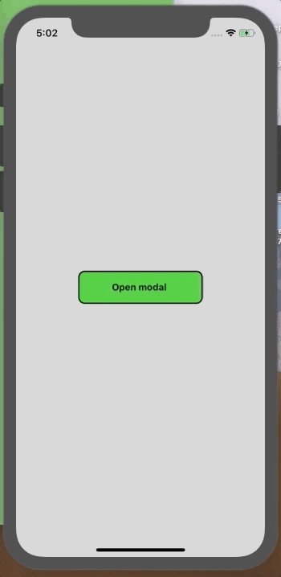

# React Native Bottom Modal



This repository contains an MVP for a bottom modal screen in React-Native.

## How it works

Put your `Modal` component in a container and add `justifyContent: 'flex-end'`.

Add the styling of what you want your modal to look like to a *different* view inside this `Modal` component.

```js
  return (
    <View style={styles.container}>
      <Modal style={styles.bottomModalView}>
        <View style={styles.modal}>
            ... 
        </View>
      </Modal>
    </View>
  );
}
```

## Links

* Based on [react-native-modal](https://github.com/react-native-modal/react-native-modal)